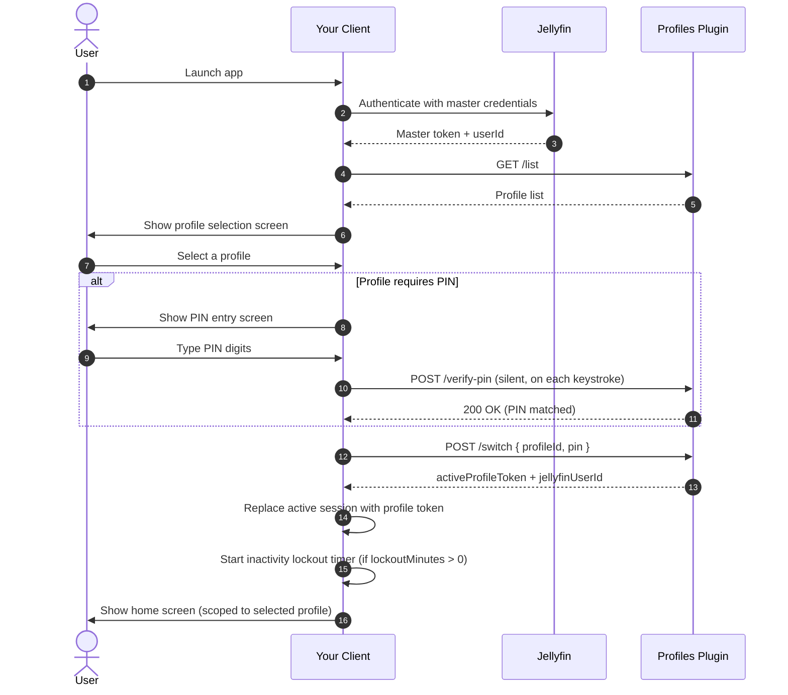

# Jellyfin Profiles Plugin — Developer API Reference

**Plugin ID:** `b1462fca-774b-4b13-8d02-e2d4f2bc18b9`
**Compatible with:** Jellyfin Server 10.11.x (10.11.0 – 10.11.11)
**Base path:** All endpoints are relative to your Jellyfin server root: `https://<server>/plugins/profiles/`

---

## Overview

The Profiles Plugin adds Netflix-style profile switching to Jellyfin. It creates isolated Jellyfin user accounts (sub-profiles) under a primary master account. When a profile is selected, the plugin issues a scoped session token for that profile — giving it fully isolated watch history, parental controls, and library access without requiring a separate Jellyfin login.

As a third-party client, your responsibilities are to:
1. Detect that the plugin is active and fetch the profile list after login.
2. Display a profile selection screen before showing the home view.
3. Swap your active session token after the user selects a profile.
4. Provide a way to return to the profile selector at any time.
5. Implement the inactivity lockout timer if the selected profile has a `lockoutMinutes` setting greater than zero.

---

## Authentication

Every request to the plugin API must include a standard Jellyfin authorization header. Use the **Master User's token** for all profile management and list calls. After a successful profile switch, use the **returned profile token** for all subsequent Jellyfin API calls.

```
Authorization: MediaBrowser Client="<AppName>", Device="<DeviceName>", DeviceId="<UniqueId>", Version="<AppVersion>", Token="<token>"
```

Both `Authorization` and `X-Emby-Authorization` header names are accepted.

> [!IMPORTANT]
> Never log the full `Authorization` header or any token value to the browser console, device logs, or analytics. Tokens grant full API access to the associated Jellyfin user.

---

## Endpoints

### `GET /plugins/profiles/list`

Returns all profiles available to the authenticated user, including the master profile and all sub-profiles.

**Authorization:** Master User token

**Response `200 OK`:**
```json
[
  {
    "profileUserId": "8e3cdfa5-79a8-4bb9-bd9a-0e96b7dc974a",
    "profileName": "John",
    "avatarInitial": "J",
    "avatarColor": "#00A4DC",
    "requiresPin": true,
    "isMaster": true,
    "lockoutMinutes": 10
  },
  {
    "profileUserId": "a90f11cb-42a1-432d-94bb-97cc2d42ef8b",
    "profileName": "Kids",
    "avatarInitial": "K",
    "avatarColor": "#EC4899",
    "requiresPin": false,
    "isMaster": false,
    "lockoutMinutes": 0
  }
]
```

| Field | Type | Description |
|---|---|---|
| `profileUserId` | `string (GUID)` | Jellyfin user ID for this profile |
| `profileName` | `string` | Display name |
| `avatarInitial` | `string` | Single character initial for the avatar |
| `avatarColor` | `string` | Hex color for the avatar background |
| `requiresPin` | `boolean` | Whether a PIN is required to select this profile |
| `isMaster` | `boolean` | Whether this entry is the master account |
| `lockoutMinutes` | `integer` | Minutes of inactivity before auto-lock. `0` = never. Only enforced when `requiresPin` is `true`. |

---

### `POST /plugins/profiles/switch`

Authenticates a profile selection and returns a scoped session token. This token must replace your client's active session immediately.

**Authorization:** Master User token

**Request body:**
```json
{
  "profileId": "a90f11cb-42a1-432d-94bb-97cc2d42ef8b",
  "pin": "1234"
}
```

| Field | Type | Required | Description |
|---|---|---|---|
| `profileId` | `string (GUID)` | Yes | The `profileUserId` of the profile to switch to |
| `pin` | `string` | Conditional | Required only if `requiresPin` is `true` for this profile |

**Response `200 OK`:**
```json
{
  "activeProfileToken": "7ef4a378297b470183b0b3e6cda7670e",
  "jellyfinUserId": "a90f11cb-42a1-432d-94bb-97cc2d42ef8b"
}
```

> [!IMPORTANT]
> You must replace your client's active token and user ID with these values immediately. All subsequent Jellyfin API calls — library browsing, playback, progress reporting — must use `activeProfileToken` and `jellyfinUserId`. Store the original Master token separately so the user can switch profiles again later.

**Error responses:**

| Status | Meaning |
|---|---|
| `401 Unauthorized` | PIN was incorrect, or caller is not authorized to switch to this profile |
| `404 Not Found` | The specified `profileId` does not exist |

---

### `POST /plugins/profiles/verify-pin`

Validates a PIN for a given profile **without** performing a session switch. Use this to silently check a PIN as the user types (see [Silent PIN Verification](#silent-pin-verification)), or to pre-validate the master PIN before management operations.

**Authorization:** Master User token

**Request body:**
```json
{
  "profileId": "a90f11cb-42a1-432d-94bb-97cc2d42ef8b",
  "pin": "1234"
}
```

**Response:** `200 OK` if the PIN is correct, `401 Unauthorized` if incorrect.

---

## Integration Guide

### Session Lifecycle



### Storage Requirements

Your client must maintain two separate credential stores:

| Store | Contents | Lifetime |
|---|---|---|
| **Master credentials** | Master `userId` + Master `token` | Cleared on logout |
| **Active profile token** | `activeProfileToken` + profile `userId` | Cleared when returning to profile selector |

On app launch, if a master token is stored but no active profile token exists, show the profile selection screen before any home content.

---

### Silent PIN Verification

Rather than requiring the user to press a submit button, the recommended UX is to silently call `POST /verify-pin` after every digit is entered. When the response is `200 OK`, immediately call `POST /switch` to complete the session swap. This creates a zero-friction experience where the correct PIN auto-submits regardless of its length.

**Rules:**
- Only start calling `verify-pin` once 4 or more digits have been entered (minimum PIN length).
- Cancel any in-flight verify request when a new digit is typed (use `AbortController` or equivalent). Only the most recent request matters.
- On a `401` response, do **nothing** — the user is still typing their full PIN.
- On network error, do nothing — the user can still submit manually.
- Only show an error (red border, inline text) if the user explicitly presses Enter or a submit button while the PIN is wrong.
- When `verify-pin` returns `200`, use the captured PIN value at that moment to call `POST /switch`.

```javascript
let verifyController = null;
let switchInProgress = false;

pinInput.addEventListener('input', () => {
    const value = pinInput.value;
    if (value.length < 4 || switchInProgress) return;

    // Cancel previous in-flight check
    if (verifyController) verifyController.abort();
    verifyController = typeof AbortController !== 'undefined' ? new AbortController() : null;

    fetch('/plugins/profiles/verify-pin', {
        method: 'POST',
        headers: { 'Authorization': masterAuthHeader, 'Content-Type': 'application/json' },
        body: JSON.stringify({ profileId, pin: value }),
        ...(verifyController ? { signal: verifyController.signal } : {})
    })
    .then(res => {
        if (res.ok && !switchInProgress) {
            switchInProgress = true;
            performSwitch(profileId, value); // calls POST /switch
        }
        // 401: do nothing, user is still typing
    })
    .catch(() => { /* AbortError or network error — ignore */ });
});
```

---

### Returning to the Profile Selector

To allow users to switch profiles from within the app (e.g., via a button in the navigation bar):

1. Stop the inactivity lockout timer (if running).
2. Restore the **Master token** as the active session token in your API client.
3. Clear the stored active profile token.
4. Call `GET /list` again to refresh the profile list before display.
5. Show the profile selection screen.

---

### Inactivity Auto-lock

Each profile exposes a `lockoutMinutes` field. When this value is greater than zero **and** the profile `requiresPin` is `true`, your client must implement an inactivity lockout timer.

**Behavior:**
- Start the timer immediately after a successful profile switch.
- Reset the timer on any user interaction: mouse move, click, keydown, touchstart, scroll, pointermove, pointerdown.
- When the timer fires, perform the "Return to Profile Selector" sequence — clear the active session and show the profile chooser.
- Stop the timer whenever the profile selector is visible (to prevent double-firing).

**Lockout values:**

| Value | Meaning |
|---|---|
| `0` | Never lock (timer disabled) |
| `1` | 1 minute |
| `5` | 5 minutes (server default for PIN-protected profiles) |
| `10` | 10 minutes |
| `20` | 20 minutes |
| `30` | 30 minutes |
| `60` | 1 hour |

> [!NOTE]
> `lockoutMinutes` is always returned in the `/list` response but is only enforced by the client when the profile has `requiresPin: true`. A profile without a PIN is never auto-locked.

```javascript
function startInactivityTimer(minutes) {
    stopInactivityTimer();
    const ms = minutes * 60 * 1000;
    const events = ['mousemove', 'mousedown', 'keydown', 'touchstart',
                    'scroll', 'wheel', 'click', 'pointermove', 'pointerdown'];
    const reset = () => {
        clearTimeout(lockTimer);
        lockTimer = setTimeout(lockActiveProfile, ms);
    };
    events.forEach(ev => document.addEventListener(ev, reset, { passive: true }));
    reset();
}
```

> [!TIP]
> Include `pointermove` and `pointerdown` in your inactivity event list. LG Magic Remote and similar pointer-based TV remotes generate pointer events, not mouse events.

---

### PIN Error Handling

When `POST /switch` returns `401` on a PIN-protected profile (via explicit user submission), the recommended UX is to:
- Clear the PIN input field.
- Display an **inline** error message below the input (never use a modal alert — it blocks focus management on TV clients).
- Apply a red border/glow to the PIN input field using inline styles (class-based styles can be overridden by the host app's stylesheet).
- Keep the PIN screen open so the user can try again.
- Clear the error the moment the user starts typing a new digit.

> [!CAUTION]
> Do **not** call `pinInput.focus()` inside an event handler that is itself triggered by focus events. Doing so creates a self-canceling loop where the error display is immediately wiped by the focus event's clear-error listener.

---

## Profile Management (Master Only)

The following endpoints are only callable by the master user. Sub-profile tokens will receive `401 Unauthorized`.

### `POST /plugins/profiles/create`

Creates a new sub-profile.

**Request body:**
```json
{
  "profileName": "Kids",
  "pin": "4321",
  "avatarColor": "#EC4899",
  "maxParentalRating": "6",
  "enabledFolders": ["e67b2d5a39cb400ba45a7b0a70198de7"],
  "lockoutMinutes": 5,
  "masterPin": "1234"
}
```

| Field | Type | Required | Description |
|---|---|---|---|
| `profileName` | `string` | Yes | Display name for the new profile |
| `pin` | `string` | No | 4–8 digit numeric PIN. Omit or pass `null` for no PIN |
| `avatarColor` | `string` | No | Hex color for the avatar. Defaults to `#00A4DC` |
| `maxParentalRating` | `string` | No | `"6"` (G), `"10"` (PG), `"14"` (PG-13), `"17"` (R). Omit for no restriction |
| `enabledFolders` | `string[]` | No | Array of library IDs accessible to this profile. Pass an empty array to deny all library access |
| `lockoutMinutes` | `integer` | No | Inactivity lockout in minutes. `0` = never. Defaults to `5`. Only enforced when the profile has a PIN |
| `masterPin` | `string` | Conditional | Required if the master account has a PIN and the server requires it for profile creation |

**Response `200 OK`:**
```json
{
  "profileUserId": "...",
  "profileName": "Kids"
}
```

---

### `POST /plugins/profiles/update`

Updates an existing profile's name, PIN, color, parental rating, library access, or lockout timer.

**Request body:**
```json
{
  "profileId": "a90f11cb-42a1-432d-94bb-97cc2d42ef8b",
  "profileName": "Kids (Edited)",
  "pin": "",
  "avatarColor": "#D946EF",
  "maxParentalRating": "10",
  "enabledFolders": ["e67b2d5a39cb400ba45a7b0a70198de7"],
  "lockoutMinutes": 30,
  "masterPin": "1234"
}
```

| Field | Type | Required | Description |
|---|---|---|---|
| `profileId` | `string (GUID)` | Yes | The profile to update |
| `profileName` | `string` | Yes | New display name |
| `pin` | `string \| null` | No | Pass a new value to set/change the PIN. Pass `""` (empty string) to **remove** the PIN. Pass `null` to leave the current PIN unchanged |
| `avatarColor` | `string` | No | New hex color |
| `maxParentalRating` | `string \| null` | No | See create endpoint for values. Pass `null` to remove restriction |
| `enabledFolders` | `string[] \| null` | No | Updated library access list. Pass `null` to leave unchanged |
| `lockoutMinutes` | `integer \| null` | No | New lockout setting. `0` = never. Pass `null` to leave unchanged |
| `masterPin` | `string` | Conditional | Required if the master account has a PIN set |

---

### `POST /plugins/profiles/delete`

Permanently deletes a sub-profile and its underlying Jellyfin user account. This action is irreversible.

**Request body:**
```json
{
  "profileId": "a90f11cb-42a1-432d-94bb-97cc2d42ef8b",
  "masterPin": "1234"
}
```

| Field | Type | Required | Description |
|---|---|---|---|
| `profileId` | `string (GUID)` | Yes | The profile to delete |
| `masterPin` | `string` | Conditional | Required if the master account has a PIN set |

**Response:** `200 OK` on success. `404 Not Found` if the profile does not exist.

---

### `GET /plugins/profiles/libraries`

Returns the list of media libraries visible to the currently authenticated user. Use this to populate a library access selector when creating or editing profiles.

**Response `200 OK`:**
```json
[
  {
    "id": "e67b2d5a39cb400ba45a7b0a70198de7",
    "name": "Movies",
    "collectionType": "movies"
  },
  {
    "id": "c19b2e7a25ff402da18b2b6c90197ee4",
    "name": "TV Shows",
    "collectionType": "tvshows"
  }
]
```

---

## Server Admin Endpoints

These endpoints require the caller to be a **Jellyfin server administrator**. They are intended for server management tooling only, not for end-user profile switching clients.

### `GET /plugins/profiles/admin/mappings`

Returns a full mapping of all master users and their associated sub-profiles across the entire server.

**Authorization:** Server Admin token

**Response `200 OK`:**
```json
{
  "masterUsers": [
    {
      "profileUserId": "8e3cdfa5-79a8-4bb9-bd9a-0e96b7dc974a",
      "profileName": "john",
      "requiresPin": true
    }
  ],
  "subProfiles": [
    {
      "profileUserId": "a90f11cb-42a1-432d-94bb-97cc2d42ef8b",
      "profileName": "Kids",
      "masterName": "john",
      "requiresPin": false
    }
  ]
}
```

---

### `POST /plugins/profiles/admin/reset-pin`

Removes the PIN from any profile without requiring knowledge of the existing PIN. Use this for account recovery.

**Authorization:** Server Admin token

**Request body:**
```json
{
  "profileId": "a90f11cb-42a1-432d-94bb-97cc2d42ef8b"
}
```

**Response:** `200 OK` on success. `404 Not Found` if no mapping exists for this profile.

---

## Platform Compatibility

### Web (Desktop & Mobile Browsers)

- Use the standard `fetch()` API with `AbortController` for silent PIN verification.
- Store master credentials in `localStorage` (persists across sessions) and the active profile token in `sessionStorage` (cleared when the browser tab is closed, which forces re-selection on next visit — this is the intended security behavior).
- On mobile, use `inputmode="numeric"` on PIN inputs to prompt the numeric keypad. Combine with `type="password"` to mask digits.

### Mobile Native Apps (iOS / Android)

- When wrapping Jellyfin in a native WebView, ensure `localStorage` and `sessionStorage` are available and not sandboxed.
- Subscribe to app lifecycle events (`UIApplicationDidEnterBackgroundNotification` on iOS, `onPause` on Android). When the app backgrounds, consider treating it as inactivity for lockout timer purposes.
- `AbortController` is available in all modern WebViews (iOS 12.1+, Android Chrome 66+).

---

### Apple tvOS

tvOS has a fundamentally different integration story from all other platforms. The majority of Jellyfin tvOS clients (Swiftfin being the primary one) are **fully native UIKit/SwiftUI apps** — they talk directly to the REST API over `URLSession` or equivalent, never touching the web plugin UI at all.

#### Native tvOS Apps (Swiftfin / Swift)

The REST API contract is identical on tvOS — same endpoints, same request bodies, same responses. What differs is everything around the HTTP calls:

**Token Storage:** Use **Keychain** (`SecItemAdd` / `SecItemCopyMatching`), not `UserDefaults`. Keychain entries survive app reinstalls if iCloud Keychain backup is enabled, are hardware-encrypted, and are properly sandboxed from other apps. `UserDefaults` is functionally equivalent to unencrypted plain text storage and is not appropriate for session tokens.

```swift
// Store master token in Keychain
let query: [String: Any] = [
    kSecClass as String: kSecClassGenericPassword,
    kSecAttrService as String: "JellyfinProfilesMasterToken",
    kSecValueData as String: masterToken.data(using: .utf8)!
]
SecItemAdd(query as CFDictionary, nil)
```

**Lockout Timer:** Use `Timer.scheduledTimer` or `DispatchQueue.asyncAfter` rather than JavaScript `setTimeout`. Subscribe to `UIApplicationWillResignActiveNotification` — this fires when the user presses the tvOS Home button, when the Apple TV auto-dims, or when the screensaver activates. On receipt, treat the app as inactive and show the profile selector on next foreground.

```swift
NotificationCenter.default.addObserver(
    forName: UIApplication.willResignActiveNotification,
    object: nil, queue: .main
) { _ in
    // Treat as inactivity — show profile selector on resume
    ProfileSessionManager.shared.markNeedsReselection()
}

NotificationCenter.default.addObserver(
    forName: UIApplication.didBecomeActiveNotification,
    object: nil, queue: .main
) { _ in
    if ProfileSessionManager.shared.needsReselection {
        showProfileSelector()
    }
}
```

> [!IMPORTANT]
> **Do not rely on a timer firing during app suspension.** When Apple TV goes to sleep or the system suspends your app, all Swift `Timer` objects stop firing. The correct pattern is to record the timestamp when the app was last active (`Date()`), then on `didBecomeActive` compare the elapsed time against `lockoutMinutes`. If the elapsed time exceeds the threshold, force re-selection.

```swift
// On resign active:
UserDefaults.standard.set(Date(), forKey: "lastActiveTimestamp")

// On become active:
if let last = UserDefaults.standard.object(forKey: "lastActiveTimestamp") as? Date {
    let elapsed = Date().timeIntervalSince(last) / 60  // minutes
    if elapsed >= Double(lockoutMinutes) && lockoutMinutes > 0 {
        showProfileSelector()
    }
}
```

**Siri Remote Input:** The Siri Remote provides a clickpad surface (swipe + click). In native UIKit apps, navigation is handled by tvOS's **Focus Engine** (`UIFocusEnvironment`). Profile cards should conform to `UIFocusItem` and respond to `shouldUpdateFocus`. You don't handle raw D-pad keystrokes — the Focus Engine routes navigation automatically.

**PIN Entry:** Use a custom numpad built with `UICollectionView` or similar — do **not** use a `UITextField` with `UIKeyboardType.numberPad` as the tvOS system keyboard is always a full QWERTY overlay and ignores the `keyboardType` hint. A 10-button numeric grid (0–9 + delete) driven by Siri Remote focus gives the correct UX for tvOS.

---

#### WKWebView-based tvOS Apps

Some clients embed Jellyfin's web interface in a `WKWebView`. The web plugin UI runs inside this WebView. In this context:

**Siri Remote Events in WKWebView:** The Siri Remote touchpad generates **`mousemove` events** when swiping (not `pointermove`, not `touchmove`). Click generates a `click` event. The Menu button generates `keydown` with `key === 'Escape'`. Include `mousemove` explicitly in your inactivity event list — it will be the primary activity signal from the Siri Remote.

```javascript
// For tvOS WKWebView, mousemove is the Siri Remote swipe signal
const events = [
    'mousemove', 'mousedown', 'click',      // Siri Remote
    'keydown',                               // Menu button (Escape)
    'touchstart', 'scroll',                  // fallbacks
    'pointermove', 'pointerdown'             // newer tvOS WebKit versions
];
```

**`inputmode="numeric"` does not work on tvOS.** The tvOS system keyboard is always the full QWERTY overlay, regardless of `inputmode`, `type="tel"`, or `type="number"`. There is no numeric-only keyboard on tvOS. Design your PIN entry screen to work with a full keyboard — do not rely on a numeric pad appearing.

**App Suspension and Timers:** When the Apple TV screensaver activates or the app is backgrounded, the WKWebView's JavaScript runtime is paused. `setTimeout` and `setInterval` timers **do not fire** during suspension. When the app resumes, there is no automatic signal to JavaScript that time has passed. To handle this in a WKWebView context, use native app lifecycle hooks to inject a JavaScript call on resume:

```swift
// In your native app delegate / scene delegate:
NotificationCenter.default.addObserver(
    forName: UIApplication.didBecomeActiveNotification,
    object: nil, queue: .main
) { [weak self] _ in
    // Inject a resume check into the web layer
    self?.webView.evaluateJavaScript("ProfilesPlugin.onAppResume();")
}
```

Then in your JavaScript:

```javascript
// In profiles.js or your client code:
ProfilesPlugin.onAppResume = function() {
    // Re-check lockout state on resume since timers may have missed
    this.initLockoutTimer();
};
```

**`sessionStorage` on tvOS WKWebView:** Each `WKWebView` instance gets its own session. If the WKWebView is recreated (e.g., after a memory warning), `sessionStorage` is cleared. Use native storage (Keychain for tokens, `UserDefaults` for non-sensitive preferences) and communicate values to the WebView via `WKUserContentController` message handlers or JS injection on load.

**`AbortController` availability:** Available in tvOS 12.1+ (WebKit shipped with tvOS 12.1). All current tvOS versions (15+) support it fully.

### TV & Remote Control Clients (Tizen, webOS, Fire TV, Android TV)

**Focusability:** All interactive elements — profile cards, action buttons, PIN inputs, color pickers, dropdowns — must be focusable via D-pad navigation. Add `tabindex="0"` to any non-native interactive element (e.g., `div`, `span`).

**Auto-focus:** When the profile selector is displayed, programmatically focus the first profile card so the user can immediately navigate without pressing Tab.

```javascript
setTimeout(() => {
    const first = overlay.querySelector('[tabindex="0"], button, input');
    if (first) first.focus();
}, 50);
```

**Enter/Select handling:** TV remote OK/Select buttons fire `keydown` events with `key === 'Enter'` or `key === ' '`. Register handlers on all focusable elements and trigger their click action:

```javascript
element.addEventListener('keydown', (e) => {
    if (e.key === 'Enter' || e.key === ' ') {
        e.preventDefault();
        element.click();
    }
});
```

**Focus styling:** Remote controls do not trigger CSS `:hover`. Replicate hover animations on `:focus` and `:focus-within` to provide visible selection feedback:

```css
.profile-card:focus {
    transform: scale(1.06);
    box-shadow: 0 0 0 3px #00a4dc;
    outline: none;
}
```

**Inactivity events on TV:** Include `pointermove` and `pointerdown` in your inactivity event list. LG Magic Remote, Samsung Smart Remote in pointer mode, and similar devices generate pointer events rather than mouse events. Without these, the lockout timer will not reset when the user navigates with a pointing remote.

**PIN entry on TV:** On most TV browsers, `type="password"` combined with `inputmode="numeric"` will suggest a numeric keyboard. However, on some older platforms a full character keyboard may appear regardless. Design your PIN entry screen to be usable with any keyboard layout.

**`sessionStorage` on TV:** Some TV browsers clear `sessionStorage` when the app is backgrounded or when the user presses the Home button and returns. This will cause a fresh profile selection screen to appear on re-entry, which is the correct behavior for a shared TV.

**`AbortController` support:** Available on Tizen 5+ (Samsung TVs, 2018+), webOS 4+ (LG TVs, 2019+), and Fire TV. For older devices, include a graceful fallback:

```javascript
verifyController = typeof AbortController !== 'undefined' ? new AbortController() : null;
// In fetch options:
...(verifyController ? { signal: verifyController.signal } : {})
```
