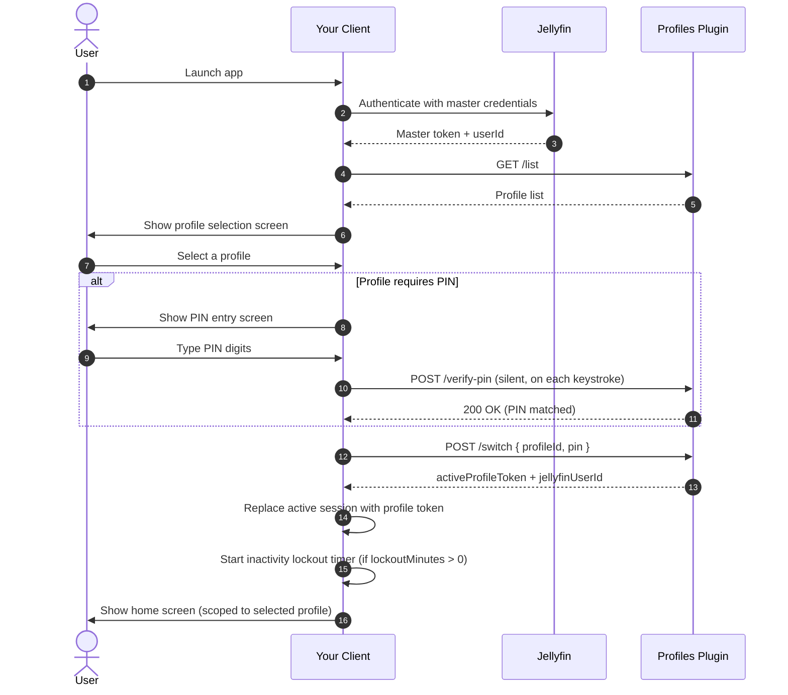

# Jellyfin Profiles Plugin — Developer API Reference

**Plugin ID:** `b1462fca-774b-4b13-8d02-e2d4f2bc18b9`  
**Compatible with:** Jellyfin Server 10.11.x (10.11.0 – 10.11.11)  
**Base path:** `https://<server>/plugins/profiles/`

---

## Overview

The Profiles plugin adds profile switching to Jellyfin. Each master account can have up to five sub-profiles, each backed by a real Jellyfin user account. Selecting a profile issues a scoped session token for that user, giving it isolated watch history, parental controls, and library access.

As a third-party client, you need to:

1. Detect that the plugin is installed and fetch the profile list after the master user logs in.
2. Show a profile selection screen before displaying home content.
3. Replace your active session token when a profile is selected.
4. Provide a way to return to the profile selector at any time.
5. Implement the inactivity lockout timer for profiles that have one configured.

---

## Authentication

Every request to the plugin API requires a standard Jellyfin authorization header. Use the **master user's token** for all management and list calls. After a successful `/switch`, use the **returned profile token** for all subsequent Jellyfin API calls.

```
Authorization: MediaBrowser Client="<AppName>", Device="<DeviceName>", DeviceId="<UniqueId>", Version="<AppVersion>", Token="<token>"
```

Both `Authorization` and `X-Emby-Authorization` are accepted.

> [!IMPORTANT]
> Never log the full `Authorization` header or any token value. Tokens grant full API access to the associated Jellyfin user.

---

## Endpoints

### `GET /plugins/profiles/list`

Returns all profiles available to the authenticated user.

**Authorization:** Master User token

**Response `200 OK`:**
```json
[
  {
    "profileUserId": "8e3cdfa5-79a8-4bb9-bd9a-0e96b7dc974a",
    "profileName": "John",
    "avatarInitial": "J",
    "avatarColor": "#00A4DC",
    "requiresPin": true,
    "isMaster": true,
    "lockoutMinutes": 10,
    "maxSubProfiles": 5
  },
  {
    "profileUserId": "a90f11cb-42a1-432d-94bb-97cc2d42ef8b",
    "profileName": "Kids",
    "avatarInitial": "K",
    "avatarColor": "#EC4899",
    "requiresPin": false,
    "isMaster": false,
    "lockoutMinutes": 0,
    "enabledFolders": ["e67b2d5a39cb400ba45a7b0a70198de7"]
  }
]
```

| Field | Type | Description |
|---|---|---|
| `profileUserId` | `string (GUID)` | Jellyfin user ID for this profile |
| `profileName` | `string` | Display name |
| `avatarInitial` | `string` | First character of the display name |
| `avatarColor` | `string` | Hex color for the avatar background |
| `requiresPin` | `boolean` | Whether a PIN is required to select this profile |
| `isMaster` | `boolean` | Whether this entry is the master account |
| `lockoutMinutes` | `integer` | Minutes of inactivity before auto-lock. `0` = never. Only relevant when `requiresPin` is `true`. |
| `maxSubProfiles` | `integer` | Maximum number of sub-profiles allowed for this master account. Only present on the master entry (`isMaster: true`). Configured by the server admin. Use this to conditionally hide or disable your "Add Profile" UI when the count of sub-profiles equals this value. |
| `enabledFolders` | `string[]` | Library GUIDs this profile can access. Only present on sub-profiles (`isMaster: false`). Empty array means no library access. Use this to pre-populate a library selector in your management UI. |

---

### `POST /plugins/profiles/switch`

Authenticates a profile selection and returns a scoped session token.

**Authorization:** Master User token

**Request body:**
```json
{
  "profileId": "a90f11cb-42a1-432d-94bb-97cc2d42ef8b",
  "pin": "1234"
}
```

| Field | Type | Required | Description |
|---|---|---|---|
| `profileId` | `string (GUID)` | Yes | The `profileUserId` of the profile to switch to |
| `pin` | `string` | Conditional | Required only when `requiresPin` is `true` |

**Response `200 OK`:**
```json
{
  "activeProfileToken": "7ef4a378297b470183b0b3e6cda7670e",
  "jellyfinUserId": "a90f11cb-42a1-432d-94bb-97cc2d42ef8b"
}
```

> [!IMPORTANT]
> Replace your active token and user ID with these values immediately. All subsequent Jellyfin API calls — library browsing, playback, progress reporting — must use `activeProfileToken` and `jellyfinUserId`. Store the original master token separately so the user can switch profiles again later.

**Error responses:**

| Status | Meaning |
|---|---|
| `401 Unauthorized` | PIN was incorrect, or the caller is not permitted to switch to this profile |
| `404 Not Found` | `profileId` does not exist |

---

### `POST /plugins/profiles/verify-pin`

Validates a PIN without performing a session switch. Used for silent keystroke verification (see [Silent PIN Verification](#silent-pin-verification)) and for pre-validating the master PIN before management operations.

**Authorization:** Master User token

**Request body:**
```json
{
  "profileId": "a90f11cb-42a1-432d-94bb-97cc2d42ef8b",
  "pin": "1234"
}
```

**Response:** `200 OK` if the PIN is correct, `401 Unauthorized` if incorrect.

---

## Integration Guide

### Session Lifecycle



### Storage Requirements

Maintain separate stores for master credentials, the active session, and profile display state:

| Store | Key | Contents | Lifetime |
|---|---|---|---|
| **Master credentials** | `jellyfin_profiles_master_state` (`localStorage`) | Master `userId` + Master `token` | Cleared on logout |
| **Active profile token** | `jellyfin_profiles_active_token` (`sessionStorage`) | `activeProfileToken` + profile `userId` | Cleared when returning to profile selector |
| **Active profile display info** | `jellyfin_profiles_active_info` (`sessionStorage`) | `name`, `color`, `initial` of the active profile | Cleared when returning to profile selector |

On app launch, if a master token exists but no active profile token is stored, show the profile selection screen before any home content.

The `jellyfin_profiles_active_info` key is optional but useful for displaying the currently active profile name and avatar color in your UI without a separate API call. Its value is a JSON object:

```json
{
  "name": "Kids",
  "color": "#EC4899",
  "initial": "K"
}
```

---

### Silent PIN Verification

The recommended UX is to call `POST /verify-pin` silently after every digit is entered. When the server returns `200 OK`, call `POST /switch` immediately — the user never needs to press a submit button. The correct PIN length (4–8 digits) auto-submits whenever it matches.

**Rules:**
- Start calling `verify-pin` only once 4 or more digits have been entered.
- Cancel any in-flight verify request when a new digit is typed. Only the most recent request matters.
- On a `401` response, do nothing — the user is still typing.
- On network error, do nothing — the user can still submit manually with Enter.
- Only show an error (red border, inline message) if the user explicitly submits with Enter or a submit button while the PIN is wrong.
- When `verify-pin` returns `200`, use the PIN value captured at that moment to call `POST /switch`.

```javascript
let verifyController = null;
let switchInProgress = false;

pinInput.addEventListener('input', () => {
    const value = pinInput.value;
    if (value.length < 4 || switchInProgress) return;

    if (verifyController) verifyController.abort();
    verifyController = typeof AbortController !== 'undefined' ? new AbortController() : null;

    fetch('/plugins/profiles/verify-pin', {
        method: 'POST',
        headers: { 'Authorization': masterAuthHeader, 'Content-Type': 'application/json' },
        body: JSON.stringify({ profileId, pin: value }),
        ...(verifyController ? { signal: verifyController.signal } : {})
    })
    .then(res => {
        if (res.ok && !switchInProgress) {
            switchInProgress = true;
            performSwitch(profileId, value); // calls POST /switch
        }
        // 401: do nothing, user is still typing
    })
    .catch(() => { /* AbortError or network error — ignore */ });
});
```

---

### Returning to the Profile Selector

To let users switch profiles from within the app (a button in the nav bar, a settings option, etc.):

1. Stop the inactivity lockout timer.
2. Restore the master token as the active session in your API client.
3. Clear the stored active profile token (`jellyfin_profiles_active_token`).
4. Clear the active profile display info (`jellyfin_profiles_active_info`).
5. Call `GET /list` again to refresh the profile list.
6. Show the profile selection screen.

---

### Inactivity Auto-lock

Each profile exposes a `lockoutMinutes` field. When this value is greater than zero **and** the profile has `requiresPin: true`, implement an inactivity lockout timer.

**Behavior:**
- Start the timer immediately after a successful profile switch.
- Reset it on any user interaction: mouse move, click, keydown, touchstart, scroll, pointermove, pointerdown.
- When the timer fires, perform the return-to-selector sequence — clear the active session and show the profile chooser.
- Stop the timer while the profile selector is visible.

**Lockout values:**

| Value | Meaning |
|---|---|
| `0` | Never lock |
| `1` | 1 minute |
| `5` | 5 minutes (default for PIN-protected profiles) |
| `10` | 10 minutes |
| `20` | 20 minutes |
| `30` | 30 minutes |
| `60` | 1 hour |

> [!NOTE]
> `lockoutMinutes` is always present in the `/list` response but only enforced when the profile has `requiresPin: true`. Profiles without a PIN are never auto-locked regardless of this value.

```javascript
function startInactivityTimer(minutes) {
    stopInactivityTimer();
    const ms = minutes * 60 * 1000;
    const events = ['mousemove', 'mousedown', 'keydown', 'touchstart',
                    'scroll', 'wheel', 'click', 'pointermove', 'pointerdown'];
    const reset = () => {
        clearTimeout(lockTimer);
        lockTimer = setTimeout(lockActiveProfile, ms);
    };
    events.forEach(ev => document.addEventListener(ev, reset, { passive: true }));
    reset();
}
```

> [!TIP]
> Include `pointermove` and `pointerdown` in your event list. LG Magic Remote and similar pointing TV remotes generate pointer events, not mouse events.

---

### PIN Error Handling

When `POST /switch` returns `401` after an explicit user submission:

- Clear the PIN input field.
- Display an **inline** error message below the input — never use a modal alert, it breaks focus management on TV clients.
- Apply a red border/glow to the input using inline styles (class-based styles may be overridden by the host stylesheet).
- Keep the PIN screen open so the user can retry.
- Clear the error the moment the user starts typing again.

> [!CAUTION]
> Do not call `pinInput.focus()` inside a handler that is itself triggered by focus events. This creates a loop where the error display is cleared immediately by the focus event's own listener.

---

## Switch Profile Button (Web Clients)

The plugin injects a **Switch Profile** button into Jellyfin's header button row (next to search and the user account icon). This section describes its behavior for custom web clients and TV browser integrations.

### Visibility Rules

The button is only shown when a profile session is active. Within that constraint:

| Context | Visible? |
|---|---|
| Home screen | ✅ |
| Library / browse pages | ✅ |
| Item detail page | ✅ |
| Profiles plugin settings page | ✅ |
| Active video/audio playback | ❌ |
| Server dashboard and all admin pages | ❌ |
| Login / server select | ❌ |

The button is hidden on all Jellyfin server management pages (users, libraries, logs, tasks, plugins, network, etc.). The one exception is the Profiles plugin's own settings page (`#/configurationpage?name=Profiles`), where it remains visible.

When hiding, the button fades out over 150 ms rather than disappearing instantly. The plugin detects the video player by checking for the OSD element in the DOM — the button hides as soon as the player UI appears, regardless of whether the URL has changed.

### Active Profile Indicator

When a profile session is active, the button displays the current profile's avatar — a colored circle containing the profile's initial — rather than a generic icon. This gives the user a persistent, at-a-glance reminder of which profile they are in.

The active profile name, color, and initial are stored in `sessionStorage` under the key `jellyfin_profiles_active_info` at the moment of profile selection. Custom web clients and web-based TV integrations can read this key to render the same indicator in their own UI without an additional API call.

### D-pad Navigation (Tizen / webOS)

From the home content grid:

1. Press **Up** to move focus into the header bar.
2. Press **Left** or **Right** to navigate between header icons until the Switch Profile button is focused. The plugin's CSS gives it a visible glow on `:focus`.
3. Press **OK / Enter / Select** to activate. This clears the active profile session and reloads the page, showing the profile selector.

> [!NOTE]
> Jellyfin's React client intercepts some arrow-key events for horizontal content row scrolling. If focus gets stuck inside a content row and pressing Up doesn't reach the header, this is the host client's focus management, not the plugin's. Custom TV clients can work around it by providing a dedicated menu button that calls the switch sequence directly.

The plugin registers both a `click` handler and an explicit `keydown` handler (`Enter`/`Space`) on the button to cover platforms where injected elements don't automatically receive click events on Enter.

### Custom Client Button

If your client has its own dedicated "Switch Profile" button (side menu, settings panel, etc.), the action when pressed is:

```javascript
function switchProfile() {
    const masterState = JSON.parse(localStorage.getItem('jellyfin_profiles_master_state'));
    if (!masterState) return;
    sessionStorage.removeItem('jellyfin_profiles_active_token');
    sessionStorage.removeItem('jellyfin_profiles_active_info');
    ApiClient.setAuthenticationInfo(masterState.masterToken, masterState.masterUserId);
    window.location.reload(); // or navigate to your own profile selector screen
}
```

After a successful `POST /switch`, store the active profile's display info so your UI can show the indicator without an extra call:

```javascript
// After POST /switch returns 200:
sessionStorage.setItem('jellyfin_profiles_active_info', JSON.stringify({
    name: selectedProfile.profileName,
    color: selectedProfile.avatarColor,
    initial: selectedProfile.avatarInitial
}));
```

---

## Profile Management (Master Only)

These endpoints are only callable with the master user's token. Sub-profile tokens receive `401 Unauthorized`.

### `POST /plugins/profiles/create`

Creates a new sub-profile.

**Request body:**
```json
{
  "profileName": "Kids",
  "pin": "4321",
  "avatarColor": "#EC4899",
  "maxParentalRating": "6",
  "enabledFolders": ["e67b2d5a39cb400ba45a7b0a70198de7"],
  "lockoutMinutes": 5,
  "masterPin": "1234"
}
```

| Field | Type | Required | Description |
|---|---|---|---|
| `profileName` | `string` | Yes | Display name for the new profile |
| `pin` | `string` | No | 4–8 digit numeric PIN. Omit or pass `null` for no PIN |
| `avatarColor` | `string` | No | Hex color for the avatar. Defaults to `#00A4DC` |
| `maxParentalRating` | `string` | No | `"6"` (G/TV-G), `"10"` (PG/TV-PG), `"14"` (PG-13/TV-14), `"17"` (R/TV-MA). Omit for no restriction |
| `enabledFolders` | `string[]` | No | Library GUIDs this profile can access. Pass an empty array to deny all library access |
| `lockoutMinutes` | `integer` | No | Inactivity lockout in minutes. `0` = never. Defaults to `5`. Only enforced when the profile has a PIN |
| `masterPin` | `string` | Conditional | Required if the master account has a PIN |

**Response `200 OK`:**
```json
{
  "profileUserId": "...",
  "profileName": "Kids"
}
```

---

### `POST /plugins/profiles/update`

Updates an existing profile.

**Request body:**
```json
{
  "profileId": "a90f11cb-42a1-432d-94bb-97cc2d42ef8b",
  "profileName": "Kids (Edited)",
  "pin": "",
  "avatarColor": "#D946EF",
  "maxParentalRating": "10",
  "enabledFolders": ["e67b2d5a39cb400ba45a7b0a70198de7"],
  "lockoutMinutes": 30,
  "masterPin": "1234"
}
```

| Field | Type | Required | Description |
|---|---|---|---|
| `profileId` | `string (GUID)` | Yes | The profile to update |
| `profileName` | `string` | Yes | New display name |
| `pin` | `string \| null` | No | Pass a new value to set or change the PIN. Pass `""` (empty string) to remove the PIN. Pass `null` to leave the current PIN unchanged |
| `avatarColor` | `string` | No | New hex color |
| `maxParentalRating` | `string \| null` | No | See create endpoint for valid values. Pass `null` to remove the restriction |
| `enabledFolders` | `string[] \| null` | No | Updated library access list. Pass `null` to leave unchanged |
| `lockoutMinutes` | `integer \| null` | No | New lockout setting. `0` = never. Pass `null` to leave unchanged |
| `masterPin` | `string` | Conditional | Required if the master account has a PIN |

---

### `POST /plugins/profiles/delete`

Permanently deletes a sub-profile and its underlying Jellyfin user account.

**Request body:**
```json
{
  "profileId": "a90f11cb-42a1-432d-94bb-97cc2d42ef8b",
  "masterPin": "1234"
}
```

| Field | Type | Required | Description |
|---|---|---|---|
| `profileId` | `string (GUID)` | Yes | The profile to delete |
| `masterPin` | `string` | Conditional | Required if the master account has a PIN |

**Response:** `200 OK` on success. `404 Not Found` if the profile does not exist.

---

### `GET /plugins/profiles/libraries`

Returns the media libraries visible to the authenticated user. Use this to populate a library access selector when creating or editing profiles.

**Response `200 OK`:**
```json
[
  {
    "id": "e67b2d5a39cb400ba45a7b0a70198de7",
    "name": "Movies",
    "collectionType": "movies"
  },
  {
    "id": "c19b2e7a25ff402da18b2b6c90197ee4",
    "name": "TV Shows",
    "collectionType": "tvshows"
  }
]
```

---

## Server Admin Endpoints

These endpoints require a Jellyfin server administrator token. They are not intended for end-user profile switching clients.

### `GET /plugins/profiles/admin/mappings`

Returns all master users and their sub-profiles across the server.

**Authorization:** Server Admin token

**Response `200 OK`:**
```json
{
  "masterUsers": [
    {
      "profileUserId": "8e3cdfa5-79a8-4bb9-bd9a-0e96b7dc974a",
      "profileName": "john",
      "requiresPin": true
    }
  ],
  "subProfiles": [
    {
      "profileUserId": "a90f11cb-42a1-432d-94bb-97cc2d42ef8b",
      "profileName": "Kids",
      "masterName": "john",
      "requiresPin": false
    }
  ]
}
```

---

### `POST /plugins/profiles/admin/reset-pin`

Removes the PIN from any profile without requiring the existing PIN. Intended for account recovery.

**Authorization:** Server Admin token

**Request body:**
```json
{
  "profileId": "a90f11cb-42a1-432d-94bb-97cc2d42ef8b"
}
```

**Response:** `200 OK` on success. `404 Not Found` if no mapping exists for this profile.

---

## Platform Compatibility

### Web (Desktop & Mobile Browsers)

- Use `fetch()` with `AbortController` for silent PIN verification.
- Store master credentials in `localStorage` (persists across sessions). Store the active profile token in `sessionStorage` (cleared when the tab closes, which forces re-selection — this is expected behavior).
- On mobile, use `inputmode="numeric"` on PIN inputs to show the numeric keypad. Combine with `type="password"` to mask digits as they're entered.

---

### Mobile Native Apps (iOS / Android)

- When wrapping Jellyfin in a native WebView, confirm that `localStorage` and `sessionStorage` are available and not sandboxed.
- Subscribe to app lifecycle events (`UIApplicationDidEnterBackgroundNotification` on iOS, `onPause` on Android). When the app backgrounds, treat it as inactivity for lockout timer purposes.
- `AbortController` is available in all modern WebViews (iOS 12.1+, Android Chrome 66+).

---

### Apple tvOS

Most Jellyfin tvOS clients (Swiftfin being the main one) are fully native UIKit/SwiftUI apps that call the REST API directly over `URLSession` — the web plugin UI is not involved.

#### Native tvOS Apps (Swiftfin / Swift)

The REST API contract is identical on tvOS. What differs is everything around the HTTP calls.

**Token Storage:** Use **Keychain** (`SecItemAdd` / `SecItemCopyMatching`), not `UserDefaults`. Keychain entries are hardware-encrypted and properly sandboxed. `UserDefaults` is functionally equivalent to unencrypted storage and is not appropriate for session tokens.

```swift
let query: [String: Any] = [
    kSecClass as String: kSecClassGenericPassword,
    kSecAttrService as String: "JellyfinProfilesMasterToken",
    kSecValueData as String: masterToken.data(using: .utf8)!
]
SecItemAdd(query as CFDictionary, nil)
```

**Lockout Timer:** Use `Timer.scheduledTimer` or `DispatchQueue.asyncAfter`. Subscribe to `UIApplicationWillResignActiveNotification` — this fires when the user presses the tvOS Home button, when the Apple TV auto-dims, or when the screensaver activates.

```swift
NotificationCenter.default.addObserver(
    forName: UIApplication.willResignActiveNotification,
    object: nil, queue: .main
) { _ in
    ProfileSessionManager.shared.markNeedsReselection()
}

NotificationCenter.default.addObserver(
    forName: UIApplication.didBecomeActiveNotification,
    object: nil, queue: .main
) { _ in
    if ProfileSessionManager.shared.needsReselection {
        showProfileSelector()
    }
}
```

> [!IMPORTANT]
> Do not rely on a timer firing during app suspension. When Apple TV goes to sleep or suspends your app, all Swift `Timer` objects stop. The correct approach is to record a timestamp when the app was last active, then on `didBecomeActive` compare the elapsed time against `lockoutMinutes`.

```swift
// On resign active:
UserDefaults.standard.set(Date(), forKey: "lastActiveTimestamp")

// On become active:
if let last = UserDefaults.standard.object(forKey: "lastActiveTimestamp") as? Date {
    let elapsed = Date().timeIntervalSince(last) / 60  // minutes
    if elapsed >= Double(lockoutMinutes) && lockoutMinutes > 0 {
        showProfileSelector()
    }
}
```

**Siri Remote Input:** In native UIKit apps, navigation is handled by tvOS's Focus Engine (`UIFocusEnvironment`). Profile cards should conform to `UIFocusItem`. You don't handle raw D-pad keystrokes — the Focus Engine routes navigation automatically.

**PIN Entry:** Build a custom numpad with `UICollectionView` or similar — do not use `UITextField` with `UIKeyboardType.numberPad`. The tvOS system keyboard is always a full QWERTY overlay and ignores the `keyboardType` hint. A 10-button grid (0–9 + delete) driven by Siri Remote focus is the standard tvOS approach.

---

#### WKWebView-based tvOS Apps

Some clients embed Jellyfin's web interface in a `WKWebView`. The web plugin runs inside this WebView.

**Siri Remote Events:** The Siri Remote touchpad generates `mousemove` events when swiping (not `pointermove`, not `touchmove`). Clicks generate a `click` event. The Menu button generates `keydown` with `key === 'Escape'`. Include `mousemove` explicitly in your inactivity event list.

```javascript
const events = [
    'mousemove', 'mousedown', 'click',   // Siri Remote
    'keydown',                            // Menu button (Escape)
    'touchstart', 'scroll',              // fallbacks
    'pointermove', 'pointerdown'         // newer tvOS WebKit
];
```

**`inputmode="numeric"` does not work on tvOS.** The tvOS system keyboard is always the full QWERTY overlay regardless of `inputmode`, `type="tel"`, or `type="number"`. Design PIN entry to work with a full keyboard.

**App Suspension and Timers:** When the screensaver activates or the app is backgrounded, the WKWebView's JavaScript runtime is paused. `setTimeout` and `setInterval` timers do not fire during suspension, and JavaScript gets no automatic signal when the app resumes. Use native lifecycle hooks to inject a resume call into the web layer:

```swift
// In your native app delegate / scene delegate:
NotificationCenter.default.addObserver(
    forName: UIApplication.didBecomeActiveNotification,
    object: nil, queue: .main
) { [weak self] _ in
    self?.webView.evaluateJavaScript("ProfilesPlugin.onAppResume();")
}
```

```javascript
ProfilesPlugin.onAppResume = function() {
    this.initLockoutTimer();
};
```

**`sessionStorage` on tvOS WKWebView:** Each `WKWebView` instance has its own session storage. If the WebView is recreated after a memory warning, `sessionStorage` is cleared. Use native storage (Keychain for tokens) and inject values into the WebView on load via `WKUserContentController` message handlers.

**`AbortController` availability:** Available in tvOS 12.1+ (WebKit shipped with tvOS 12.1). All current tvOS versions support it.

---

### TV & Remote Control Clients (Tizen, webOS, Fire TV, Android TV)

**Focusability:** Every interactive element — profile cards, buttons, PIN inputs, dropdowns — must be reachable by D-pad. Add `tabindex="0"` to any non-native interactive element (`div`, `span`, etc.).

**Auto-focus:** When the profile selector opens, programmatically focus the first profile card:

```javascript
setTimeout(() => {
    const first = overlay.querySelector('[tabindex="0"], button, input');
    if (first) first.focus();
}, 50);
```

**Enter/Select handling:** TV remote OK/Select fires `keydown` with `key === 'Enter'` or `key === ' '`:

```javascript
element.addEventListener('keydown', (e) => {
    if (e.key === 'Enter' || e.key === ' ') {
        e.preventDefault();
        element.click();
    }
});
```

**Color picker navigation in management UI:** If your management UI includes an avatar color picker (a row of color swatches), register `ArrowLeft` / `ArrowRight` on the container to move focus between swatches. This is how the plugin's own create/edit form handles D-pad navigation through the color options:

```javascript
container.addEventListener('keydown', (e) => {
    if ((e.key === 'ArrowLeft' || e.key === 'ArrowRight') && e.target.classList.contains('color-swatch')) {
        e.preventDefault();
        const swatches = Array.from(container.querySelectorAll('.color-swatch'));
        const idx = swatches.indexOf(e.target);
        if (e.key === 'ArrowLeft' && idx > 0) swatches[idx - 1].focus();
        else if (e.key === 'ArrowRight' && idx < swatches.length - 1) swatches[idx + 1].focus();
    }
    // ArrowUp / ArrowDown for vertically stacked checkbox lists
    if ((e.key === 'ArrowUp' || e.key === 'ArrowDown') && e.target.type === 'checkbox') {
        e.preventDefault();
        const boxes = Array.from(container.querySelectorAll('input[type="checkbox"]'));
        const idx = boxes.indexOf(e.target);
        if (e.key === 'ArrowUp' && idx > 0) boxes[idx - 1].focus();
        else if (e.key === 'ArrowDown' && idx < boxes.length - 1) boxes[idx + 1].focus();
    }
    // Enter to toggle a focused checkbox (some TV browsers don't fire click on Enter for checkboxes)
    if (e.key === 'Enter' && e.target.type === 'checkbox') {
        e.preventDefault();
        e.target.checked = !e.target.checked;
        e.target.dispatchEvent(new Event('change'));
    }
});
```

**Focus styling:** Remote controls don't trigger CSS `:hover`. Apply the same visual treatment to `:focus`:

```css
.profile-card:focus {
    transform: scale(1.06);
    box-shadow: 0 0 0 3px #00a4dc;
    outline: none;
}
```

**Inactivity events on TV:** Include `pointermove` and `pointerdown` in your event list. LG Magic Remote, Samsung Smart Remote in pointer mode, and similar devices generate pointer events rather than mouse events.

**PIN entry on TV:** On most TV browsers, `type="password"` combined with `inputmode="numeric"` will suggest a numeric keyboard, but some older platforms show a full character keyboard regardless. Design PIN entry to work with either.

**`sessionStorage` on TV:** Some TV browsers clear `sessionStorage` when the user presses Home and returns. This causes a fresh profile selection on re-entry, which is the correct behavior for a shared TV.

**`AbortController` support:** Available on Tizen 5+ (Samsung TVs, 2018+), webOS 5+ (LG TVs, 2020+), Fire TV Gen 3+. Use the graceful fallback pattern:

```javascript
verifyController = typeof AbortController !== 'undefined' ? new AbortController() : null;
// In fetch options:
...(verifyController ? { signal: verifyController.signal } : {})
```

#### Tizen (Samsung Smart TVs) — Version Matrix

| Tizen version | TV model years | `fetch()` | `AbortController` | Pointer events |
|---|---|---|---|---|
| 2.4 | 2015 | ❌ Use XHR | ❌ | ❌ |
| 3.0 | 2016–2017 | ✅ | ❌ | ❌ |
| 4.0 | 2017–2018 | ✅ | ❌ | ❌ |
| 5.0 | 2018–2019 | ✅ | ✅ | ✅ (pointer-mode remote) |
| 5.5–6.5 | 2020–2022 | ✅ | ✅ | ✅ |
| 7.0+ | 2023+ | ✅ | ✅ | ✅ |

On Tizen 2.4–4.x, fall back to `XMLHttpRequest` for PIN verification. The `AbortController` fallback pattern handles this gracefully.

#### webOS (LG Smart TVs) — Version Matrix

| webOS version | TV model years | `fetch()` | `AbortController` | Magic Remote pointer |
|---|---|---|---|---|
| 3.x | 2016–2017 | ✅ | ❌ | `mousemove` only |
| 4.x | 2018–2019 | ✅ | ❌ | `pointermove` + `mousemove` |
| 5.x | 2020–2021 | ✅ | ✅ | `pointermove` + `mousemove` |
| 6.x / 22–24 | 2022+ | ✅ | ✅ | `pointermove` + `mousemove` |

On webOS 3.x, the Magic Remote generates `mousemove` only. The plugin includes `mousemove` in its event list, so this is handled. On webOS 4.x+, both event types fire simultaneously.

---

### Roku

Roku channels are written in **BrightScript** with SceneGraph UI components. There is no JavaScript runtime. Developers building a native Roku channel must call the REST API directly using Roku's HTTP APIs.

**HTTP Requests:** Use `roUrlTransfer`. It is callback/event-based, not Promise-based.

```brightscript
request = CreateObject("roUrlTransfer")
request.SetUrl("https://<server>/plugins/profiles/verify-pin")
request.AddHeader("Authorization", "MediaBrowser Token=""" + masterToken + """")
request.AddHeader("Content-Type", "application/json")
request.AsyncPostFromString('{"profileId":"' + profileId + '","pin":"' + pin + '"}')
```

**Silent PIN Verification:** Call `verify-pin` after each digit by waiting on `roMessagePort` for the `roUrlEvent` and checking the response code. Use `Task` nodes for background HTTP to avoid blocking the UI thread.

**Token Storage:** Use `roRegistry` for persistent storage and in-memory variables for active session state:

```brightscript
' Store master token (persists across launches)
reg = CreateObject("roRegistry")
section = reg.GetSection("JellyfinProfiles")
section.Write("masterToken", masterToken)
section.Flush()

' Active profile token (in-memory — cleared when channel exits)
m.activeProfileToken = activeProfileToken
```

**Lockout Timer:** Use `roSGTimer`. Reset it on `roUniversalControlEvent` (remote button press):

```brightscript
m.lockoutTimer = CreateObject("roSGNode", "Timer")
m.lockoutTimer.duration = lockoutMinutes * 60
m.lockoutTimer.repeat = false
m.lockoutTimer.ObserveField("fire", "onLockoutFired")
m.lockoutTimer.control = "start"
```

**PIN Entry:** Build a custom digit-entry grid using `ZoomRowList` or `MarkupGrid` with 10 number buttons (0–9) plus a delete button. There is no system PIN keyboard on Roku.

**D-pad Navigation:** Roku D-pad fires `roUniversalControlEvent` with integer key codes (0=back, 2=up, 3=down, 4=left, 5=right, 6=OK). Route focus between profile cards using these events or SceneGraph's built-in focus chain.

> [!NOTE]
> Roku has no `sessionStorage`, `localStorage`, `fetch()`, `AbortController`, or any web standard. Only the REST API contract applies to native BrightScript channels.

---

### Xbox (Microsoft)

Jellyfin on Xbox is available through the **Edge browser** and through native **UWP apps**.

#### Xbox Edge Browser

Chromium-based Edge on Xbox supports all web standard APIs normally. Controller mapping for web content:

| Xbox button | Web event | `key` value |
|---|---|---|
| A (confirm) | `keydown` | `'Enter'` |
| B (back) | `keydown` | `'Escape'` |
| D-pad | `keydown` | `'ArrowUp'` / `'ArrowDown'` / `'ArrowLeft'` / `'ArrowRight'` |
| Left stick | `keydown` (arrows) | Same as D-pad |

The controller does not generate pointer events. Ensure all interactive elements have `:focus` styles. The browser tab stays active when the Xbox guide menu opens, so inactivity timers continue running normally.

#### UWP / Native Xbox Apps

Use `Windows.Storage.ApplicationData.Current.LocalSettings` for persistent data. For tokens, use `Windows.Security.Credentials.PasswordVault`:

```csharp
var vault = new PasswordVault();
vault.Add(new PasswordCredential("JellyfinProfiles", "masterToken", tokenValue));
```

Subscribe to `CoreApplication.Suspending` to record the last-active timestamp and `CoreApplication.Resuming` to evaluate whether lockout should trigger.

---

### PlayStation (PS4 / PS5)

**PS5:** The PS5 browser is a modern WebKit. `fetch()` and `AbortController` are supported. Standard web client behavior applies. D-pad generates `keydown` with standard arrow keys; Cross (✕) = `'Enter'`; Circle (○) = `'Escape'` (region-dependent).

**PS4:** The PS4 browser uses a significantly older WebKit engine with notable limitations:

| Feature | PS4 | PS5 |
|---|---|---|
| `fetch()` | ❌ Use XHR | ✅ |
| `AbortController` | ❌ | ✅ |
| `localStorage` | ✅ | ✅ |
| `sessionStorage` | ✅ (may be volatile) | ✅ |
| `Promise` | ❌ (older firmware) / ✅ (newer) | ✅ |

On PS4, use `XMLHttpRequest` for PIN verification. Cancel previous requests by calling `.abort()` on the XHR object:

```javascript
let activeXhr = null;

pinInput.addEventListener('input', function() {
    if (activeXhr) activeXhr.abort();
    activeXhr = new XMLHttpRequest();
    activeXhr.open('POST', verifyPinUrl, true);
    activeXhr.setRequestHeader('Authorization', masterAuthHeader);
    activeXhr.setRequestHeader('Content-Type', 'application/json');
    activeXhr.onreadystatechange = function() {
        if (activeXhr.readyState === 4) {
            if (activeXhr.status === 200) performSwitch();
            activeXhr = null;
        }
    };
    activeXhr.send(JSON.stringify({ profileId, pin: pinInput.value }));
});
```

> [!CAUTION]
> Do not target PS4 without testing on actual PS4 hardware. Browser behavior varies across firmware versions and available memory is limited enough to cause crashes on DOM-heavy pages.

---

### Desktop Apps (Electron / Jellyfin Media Player)

Jellyfin Media Player and similar Electron-based clients embed Chromium. All standard web APIs work. The main difference from mobile is timer behavior when the window is minimized:

- On mobile and tvOS, backgrounding **suspends** JavaScript — timers stop.
- In Electron, minimizing the window **does not suspend** JavaScript — timers keep running.

This means the inactivity lockout timer fires correctly even if the user minimizes the app. If you want to suppress lockout while the window is hidden:

```javascript
document.addEventListener('visibilitychange', () => {
    if (document.hidden) {
        clearTimeout(lockTimer);
    } else {
        startInactivityTimer(lockoutMinutes);
    }
});
```

This plugin uses only standard web APIs with no `contextIsolation` or `nodeIntegration` requirements.

---

### Android Native Apps

The official Jellyfin Android app is a native Kotlin/Java app that calls the REST API directly via `OkHttp` or `Retrofit`.

**Token Storage:** Use `EncryptedSharedPreferences` (backed by Android Keystore) for tokens — never plain `SharedPreferences`. Hardware-backed key storage is available on Android 6+.

```kotlin
val masterPrefs = EncryptedSharedPreferences.create(
    context,
    "jellyfin_profiles_master",
    MasterKeys.getOrCreate(MasterKeys.AES256_GCM_SPEC),
    EncryptedSharedPreferences.PrefKeyEncryptionScheme.AES256_SIV,
    EncryptedSharedPreferences.PrefValueEncryptionScheme.AES256_GCM
)
masterPrefs.edit().putString("masterToken", token).apply()
```

**Lockout Timer:** Use a `CountDownTimer` or coroutine `delay()`. Subscribe to `ProcessLifecycleOwner` for app backgrounding:

```kotlin
ProcessLifecycleOwner.get().lifecycle.addObserver(object : DefaultLifecycleObserver {
    override fun onStop(owner: LifecycleOwner) {
        prefs.edit().putLong("lastActiveMs", System.currentTimeMillis()).apply()
    }
    override fun onStart(owner: LifecycleOwner) {
        val elapsed = System.currentTimeMillis() - prefs.getLong("lastActiveMs", 0)
        if (elapsed > lockoutMinutes * 60_000L && lockoutMinutes > 0) {
            showProfileSelector()
        }
    }
})
```

**Samsung Internet Browser on Android:** Samsung's browser can retain `sessionStorage` across tab switches in ways that Chrome does not. A user returning to a Jellyfin tab after hours away might still have an active profile session. If supporting Samsung Internet, validate session freshness against a stored timestamp on every page focus event.

---

## Cross-Platform API Support Matrix

| Feature | Web (Chrome/Firefox) | Safari (macOS/iOS) | Electron | Android native | tvOS native | tvOS WKWebView | Tizen 3–4 | Tizen 5+ | webOS 3–4 | webOS 5+ | Roku | Xbox Edge | PS4 | PS5 |
|---|---|---|---|---|---|---|---|---|---|---|---|---|---|---|
| `fetch()` | ✅ | ✅ | ✅ | Via OkHttp | Via URLSession | ✅ | ✅ | ✅ | ✅ | ✅ | ❌ XHR only | ✅ | ❌ XHR only | ✅ |
| `AbortController` | ✅ | ✅ 12.1+ | ✅ | N/A | N/A | ✅ | ❌ | ✅ | ❌ | ✅ | N/A | ✅ | ❌ | ✅ |
| `localStorage` | ✅ | ✅ ⚠️ ITP | ✅ | Native storage | Native Keychain | Volatile | ✅ | ✅ | ✅ | ✅ | `roRegistry` | ✅ | ✅ | ✅ |
| `sessionStorage` | ✅ | ✅ | ✅ | N/A | Volatile | Volatile | ✅ | ✅ | ✅ | ✅ | N/A | ✅ | ⚠️ | ✅ |
| Pointer events | ✅ | ✅ | ✅ | Touch only | N/A | Siri → `mousemove` | ❌ | ✅ remote | ✅ Magic Remote | ✅ | N/A | ❌ | ❌ | ❌ |
| Timers during suspend | Running | Paused | Running | Paused (lifecycle) | Paused (lifecycle) | Paused | Running | Running | Running | Running | `roSGTimer` | Running | Running | Running |
| Secure token storage | `localStorage` | `localStorage` ⚠️ | `localStorage` | `EncryptedSharedPreferences` | Keychain | Keychain + inject | `localStorage` | `localStorage` | `localStorage` | `localStorage` | `roRegistry` | `PasswordVault` | `localStorage` | `localStorage` |

> [!TIP]
> On any platform where timers pause during suspension, use the timestamp comparison pattern on resume rather than relying on a timer to have fired at the correct time. This applies to tvOS native, Android native, and any WKWebView context.
